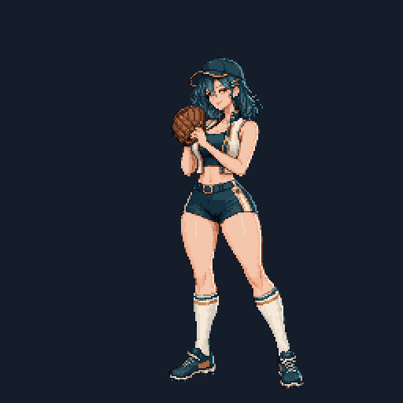
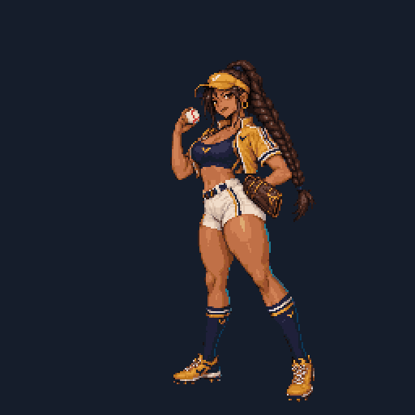

# 투수 투구 애니메이션 — PixelLab v1

2026-09-29. `pitcher-mobs-v1`의 성인 전신 디자인을 그대로 도트로 옮겨, [PixelLab](https://www.pixellab.ai)으로 실제 투구 동작을 그린 애니메이션이다. 전투에서 그 투수의 SD v2 아틀라스를 대체한다.

| 투수 | 원화 | 투구폼 | 비용 |
| --- | --- | --- | --- |
| **청록 미라주** (regular-02) | 18장 | 오버핸드 · 레그킥 정점에서 멈춤 · 머리 높이 릴리스 | 24 generations |
| **앰버 싱커** (regular-03) | 16장 | 등을 보이는 코일 · 낮고 긴 스트라이드 · 쓰리쿼터로 몸 앞 낮게 릴리스 | 13 generations |

1막 첫 갈림길(`a1-craft-game` / `a1-steady-game`)에서 고르는 두 투수가 모두 PixelLab 원화다.

 

## 규격 — 기존 전투 계약 그대로

| 항목 | 값 |
| --- | --- |
| 프레임 | 256×256 투명, 화면 왼쪽을 향해 던짐 |
| 아틀라스 | 10열×12행 = 120틱, 60fps · 2초 (`BallparkActors` / `PitcherAtlasSprite`가 그대로 재생) |
| 릴리스 | 76틱 (`RED_RUSH_RELEASE_FRAME`, 공 비행·팔 궤적·섬광이 여기에 맞춰짐) |
| 인물 크기 | 세트 자세 키 212px, 스파이크 바닥 y=247 (기존 투수 202~228px과 같은 화면 크기) |
| 원화 | 고유 드로잉을 틱 단위로 유지 — 워프나 보간 합성 없이, 모든 프레임이 그려진 원화다 |

120틱을 120장으로 채우지 않는다. 도트 애니메이션의 정석대로 **원화 한 장을 필요한 만큼 붙잡아** 리듬을 만들고, 세트로 끝나서 다음 공이 튀지 않는다. 투수마다 리듬을 다르게 둔다.

| 틱 | 청록 미라주 | 앰버 싱커 |
| --- | --- | --- |
| 0 | set (14) | set · 공을 어깨에 든 준비 자세 (14) |
| 14 · 22 | rock · turn | turn · gather |
| 30 | knee-lift (16, 균형점 멈춤) | knee-lift (14) |
| 44~46 | reach | coil — 등을 타자 쪽으로 (8) |
| 52~53 | stride (흙먼지) | stride (흙먼지) · plant |
| 59~72 | arm-extend · cocked · over-the-top · layback | cocked · layback |
| 73~75 | whip | whip |
| **76** | **release** — 머리 높이 | **release** — 몸 앞 낮게 |
| 79~89 | arm-down · follow-through · finish (12) | follow-through · finish (12) |
| 99~116 | recover ×3 → set | recover ×3 → set |

## 제작 과정

1. **기준 도트** — 원본 PNG를 256 프레임의 투구 배치(키 212px, 중심 x=150, 스트라이드 공간을 왼쪽에 확보)로 4배 캔버스에 놓고 `image_to_pixelart`(faithful, strength 200)로 256×256 도트화. 배경은 원본 알파(50% 이상)로 잘라낸다.
2. **투구 전체** — `animate_image`로 세트에서 폴로스루까지 한 번에 그린다.
3. **사이 원화** — 시작·끝 프레임을 고정한 `animate_image` 보간으로 빠진 릴리스와 폴로스루→세트 복귀를 채운다. 끝 프레임과 같아진 마지막 장은 쓰지 않는다.
4. **공** — 릴리스 이후 손에 남은 공은 지운다(청록 미라주는 `edit_image_pixen` 결과에서 던지는 손 상자만 붙임 — 이 편집은 글러브까지 지운다). 공은 게임의 Pixi가 릴리스 지점에서 이어받는다.
5. **정리** (`sequence.json`의 `cleanup`, 빌드 스크립트가 적용)
   - `groundY` — PixelLab이 몸 전체를 띄워 그린 장은 딛는 발을 지면선(y=247)으로 내린다(앰버 싱커 최대 13px).
   - `shoeMarks` — 애니메이션 모델이 스파이크 마크를 스우시 모양으로 바꿔 그리므로 원본 디자인의 마크로 되돌린다. 청록 미라주는 구리 패널, 앰버 싱커는 세트 프레임의 남색 날개 엠블럼을 그대로 찍는다(`panel: "stamp"`). 신발 색이 옷에도 쓰이면 `markBoxes`로 발 위치만 고친다.
   - 모든 원화를 한 팔레트(ΔE 4.5, 원화의 실제 색만 사용)에 맞춰 프레임 사이 색 깜빡임을 없앤다.
6. **빌드** — `scripts/build-pitcher-pixellab.py`가 아틀라스·미리보기·매니페스트를 만들고 발 기준점·스트라이드·릴리스 지점을 잰다.

### 적은 생성 횟수로 만드는 법 (앰버 싱커 13회)

- `animate_image` 비용은 **캔버스 면적 × 장수**로 매겨진다(`ceil(w·h·장수/65536)`). 256 프레임 전체 대신 동작이 들어가는 영역만 잘라 보내고 결과를 같은 위치에 다시 붙인다: 투구 전체 200×224×10장 = 7회(256×256×8장보다 2장 많고 1회 싸다), 릴리스 196×224×4장 = 3회, 복귀 148×216×4장 = 2회.
- 손 편집·마크 수정·지면 맞춤은 로컬에서 해서 생성 횟수를 쓰지 않는다.

정확한 프롬프트·시드·잡 ID·캔버스·비용은 `<id>/sequence.json`의 `generator`에 있다. 생성 결과는 PixelLab 갤러리에도 저장돼 있다.

## 파일

- `<id>/source/*.png` — 시퀀스가 쓰는 PixelLab 결과 (256 프레임 좌표, 청록 미라주는 공 제거한 두 장 포함)
- `<id>/sequence.json` — 재생 순서·틱·릴리스 자세·정리 옵션·제작 기록
- `<id>/frames/uNN-<pose>.png` — 정리된 고유 원화 (빌드 산출물)
- `atlases/<id>-pitch-120-atlas.png` — 런타임 아틀라스 (`pitcher-visuals.js`가 SD v2보다 우선 사용하고, 대체된 SD 아틀라스는 번들에서 뺀다)
- `previews/<id>-pitch.gif`, `<id>-filmstrip.png` — 검수용
- `<id>-manifest.json` — 키 포즈 틱, 팔레트 수, 측정한 stance / stride / release

```powershell
python scripts/build-pitcher-pixellab.py                 # 모든 투수 (또는 id 지정)
python scripts/pitcher-release-points.py   # PixelLab 아틀라스를 SD보다 우선해 다시 잰다
python scripts/pitcher-stride-points.py
```

`src/duel/pitcher-stance.json`은 매니페스트의 `stance` 값을 옮긴다. `tests/pitcher-pixellab.test.js`가 세 표와 매니페스트가 어긋나지 않는지, 대체된 SD 아틀라스가 번들에서 빠졌는지 확인한다.

## 다음 투수 추가

1. 원본 자세가 세트가 아니면(레드 러시 레그킥, 바이올렛 스팅 사이드암 등) 기준 도트에서 세트로 돌아가는 동작을 보간해 **거꾸로 재생**하면 와인드업이 된다.
2. 위 1~5단계를 따라 `source/`와 `sequence.json`을 채운다. 릴리스 자세가 76틱에서 시작하고 총합이 120틱이어야 빌드된다.
3. 빌드 → 두 측정 스크립트 → stance 반영 → `pitcher-visuals.js`의 SD 제외 목록에 한 줄 → `npx vitest run tests/pitcher-pixellab.test.js`.
4. `RUNTIME_ART=off npm run build` 후 `scripts/optimize-runtime-art.py`로 무손실 WebP 파생본을 만든다.

체험판에서는 `animate_image`만 쓸 수 있다. Tier 1 이상에서 열리는 `animate_with_skeleton_v3`(관절을 프레임마다 직접 지정, 원본 한 장에서 모든 프레임을 그려 얼굴·의상이 흔들리지 않음)를 쓰면 코킹·릴리스·팔 궤적을 투수별 투구폼대로 정확히 설계할 수 있다.

## 되돌리기

`atlases/<id>-pitch-120-atlas.png`를 지우고 `pitcher-visuals.js`의 SD 제외 줄을 빼면 그 투수는 SD v2 아틀라스로 돌아간다(세 JSON 값도 측정 스크립트로 다시 만든다). SD v2 에셋은 그대로 남아 있다.
