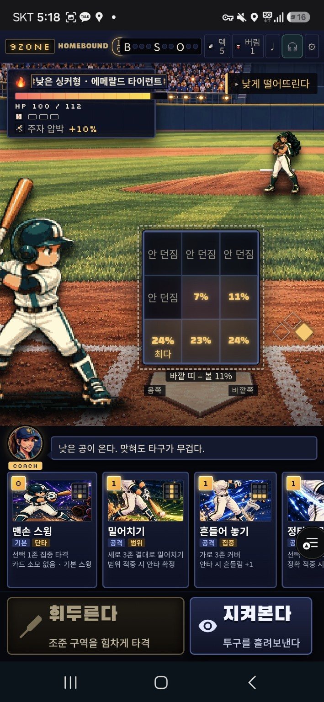
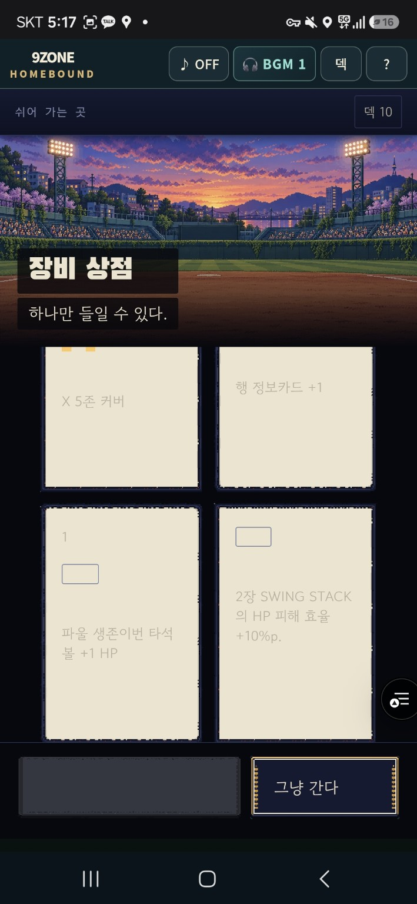
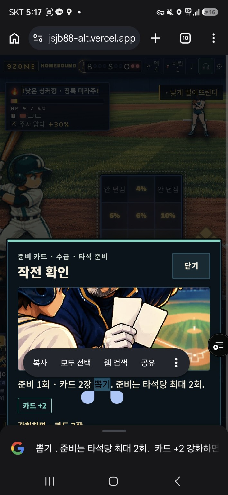
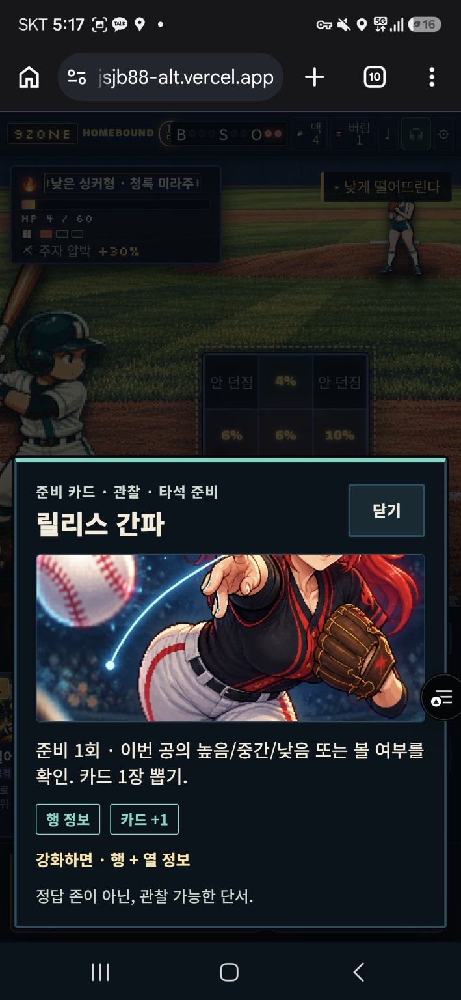
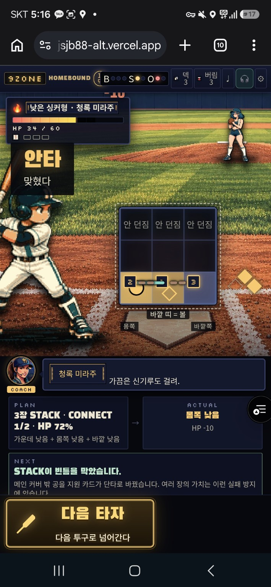
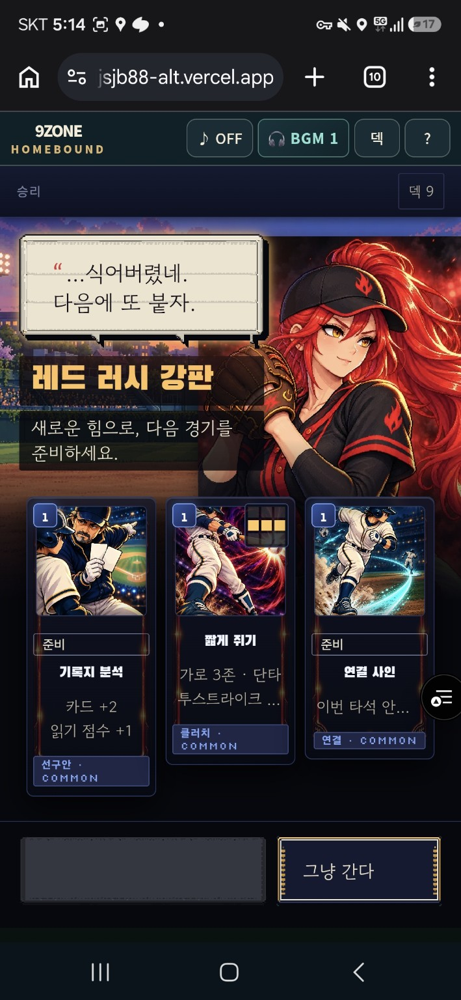
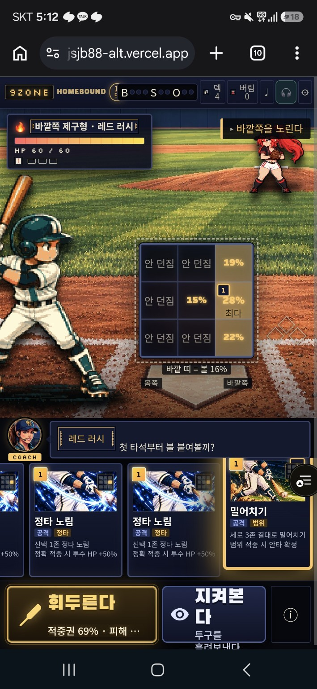

# 2026-09-28 모바일 실플레이 문제 보고서

사용자 요청: “내가 플레이하면서 문제가 있는 장면 모아놓은 거야. 문제점 정리해서 깃허브 올려줘.”

## 범위와 증거 수준

- 사용자가 제공한 **스크린샷 7장**을 직접 검토했다. 아래 항목은 화면에서 확인되는 현상과 수정 제안이며, 실기기 재현·원인 분석·수정 완료 보고가 아니다.
- Android 모바일 세로 화면, 일부 캡처에 Chrome 주소창/텍스트 선택 UI가 보인다. 캡처 시각은 17:12~17:18이며 제출일은 2026-09-28이다. 정확한 기기, CSS viewport, DPR, 글자 배율, 런 시드, 배포 SHA는 미확인이다.
- 주소창의 도메인이 생략되어 있으므로 배포 URL/브랜치를 확정할 수 없다. `claude/integrate-ag-v15` 또는 `ag/20260928-red-rush-female-art`와 동일한 실행본이라고 단정하지 않는다.
- 문서 기준 저장소: `jjsjb88-alt/9-baseball`, 작성 기반 main `8c60b81f531ae6955c2041039e8809402b79e0af`. 이는 **플레이한 빌드의 SHA가 아니다**.
- P1: 선택·판단·핵심 정보 접근을 방해하여 먼저 고칠 항목. P2: 정보 위계·그림 구도·일관성 개선. 정지 화면만으로 진행 불가(P0)를 확정한 항목은 없다.

## 추가 사용자 제보 — 배우 위치/에셋 안정성 (17:52 KST)

> “타자에셋이 자꾸 왔다갔다함. 모든 투수 캐릭터가 마운드 위에 있지 않고 이상한 데 있음.”

두 항목은 **사용자 실플레이 제보**로 등록한다. 정지 화면으로 동작을 재현했다는 뜻은 아니며, 아래 M09·M10을 이번 수정의 최우선 항목으로 올린다.

## 우선순위 요약

| ID | 우선순위 | 문제 | 근거 |
|---|---|---|---|
| M09 | P1 · 최우선 | 타자 에셋이 반복해서 왔다 갔다 함 — 이미지 교체/좌표 흔들림 구분 필요 | 사용자 추가 제보 |
| M10 | P1 · 최우선 | 모든 투수가 마운드와 맞지 않는 위치에 표시됨 | 사용자 추가 제보, 15157·15163·15171 |
| M01 | P1 | 장비 상점 선택지의 제목/효과가 거의 읽히지 않음 | 15169 |
| M02 | P1 | 상점·보상의 하단 왼쪽 버튼에 라벨이 보이지 않음 | 15169, 15161 |
| M03 | P1 | 전투의 ‘지켜본다’ 줄바꿈 및 설명 영역 이탈 | 15157 |
| M04 | P1 | 결과 설명이 하단 행동 바에 가려지고 피해 숫자도 HUD에 가림 | 15163 |
| M05 | P1 | 보상 카드 효과 설명 잘림 및 카드 높이 불일치 | 15161 |
| M06 | P1 | 카드 상세에서 브라우저 텍스트 선택/검색 UI 개입 | 15167 |
| M07 | P2 | 카드 상세 이미지에서 인물 얼굴이 잘리는 구도 | 15165, 15167 |
| M08 | P2 | 전투 HUD의 긴 이름·보드 정보 밀집으로 가독성 저하 | 15171, 15163, 15157 |

## M01 — 장비 상점 선택지 판독 불가

**화면에서 확인:** 15169의 2×2 선택지가 큰 크림색 면으로 보이며, 제목과 아이콘을 식별하기 어렵고 효과 문구도 배경과 대비가 낮다. 상단 두 카드의 윗부분은 히어로 영역 아래에서 잘린 듯한 상태다. ‘X 5존 커버’, ‘행 정보카드 +1’, ‘HP 피해 효율 +10%p’ 일부만 희미하게 읽힌다.

**영향:** 어떤 장비를 고를지 비교할 수 없다. 비활성 상태라 하더라도 이름과 효과는 읽혀야 한다.

**재현 절차(검증 예정):** 장비 상점 진입 → 선택 전 4개 옵션 확인 → 각 옵션 선택 → 세로 스크롤과 확정 동작 확인. Chrome 주소창 표시/숨김 상태를 각각 확인한다.

**조사 후보:** 카드 공용 스타일과 시설 전용 스타일 충돌, disabled opacity 상속, 이미지 레이어/텍스트 z-index, 카드 영역의 높이와 overflow. 원인으로 확정한 것은 없다.

**완료 기준:** 4개 옵션의 이름·효과·선택 상태·조건이 모두 읽히며 카드의 상단과 하단에 도달 가능하다. 밝은 배경에서는 충분히 어두운 글자를 사용하고, 활성/비활성 상태 모두 판독 가능해야 한다.

## M02 — 하단 왼쪽 버튼 라벨 소실

**화면에서 확인:** 15169 상점과 15161 승리 보상 화면에서 ‘그냥 간다’ 왼쪽의 큰 회색 버튼에 글자가 보이지 않는다.

**영향:** 버튼이 무엇을 하는지, 왜 누를 수 없는지 알 수 없다. 캡처만으로 실제 disabled 여부나 클릭 가능 여부는 확인할 수 없다.

**재현 절차(검증 예정):** 보상/장비 화면의 미선택 → 선택 → 선택 해제 상태에서 버튼의 이름, 색, 활성 상태를 비교한다.

**완료 기준:** 미선택 상태에도 ‘카드를 선택하세요’ 등 안내가 남고, 선택 후에는 ‘선택 확정’처럼 행동이 명시된다. 비활성 스타일이 라벨을 지우지 않으며 보조기술용 이름도 보존한다.

## M03 — ‘지켜본다’ 버튼 줄바꿈·설명 넘침

**화면에서 확인:** 15157에서 버튼 제목이 ‘지켜본 / 다’로 갈라지고, ‘투구를 흘려보낸다’ 설명은 버튼 아래로 밀려 하단에서 잘린다. 옆의 휘두르기 보조 문구도 ‘적중권 69% · 피해 …’로 생략된다. 15171에서는 ‘지켜본다’가 한 줄이므로 상태별 너비 배분 차이를 함께 조사해야 한다.

**영향:** 핵심 행동의 이름과 효과를 한 번에 읽을 수 없다.

**재현 절차(검증 예정):** 카드 미선택/선택, 우측 정보 버튼 표시 상태, 긴 미리보기 문구 상태를 비교한다. 작은 세로 화면과 글자 확대에서도 확인한다.

**완료 기준:** 두 행동의 제목·설명이 버튼 내부에 온전히 표시되고 실제 터치 영역과 일치한다. 피해 수치가 생략될 경우 전체 값을 확인할 수 있는 명시적인 경로를 제공한다. 무조건적인 글자 축소나 전역 overflow 숨김으로 해결하지 않는다.

## M04 — 결과 정보와 고정 UI 겹침

**화면에서 확인:** 15163에서 NEXT의 ‘메인 커버 밖 공을 지원 카드가 단타로 바꿨습니다…’ 설명이 하단 ‘다음 타자’ 행동 영역 뒤로 이어져 가려진다. 상단의 떠오르는 피해 숫자 ‘-10’도 헤더 경계에서 일부 가려진다. ACTUAL의 `HP -10`은 읽히므로 피해 정보 전체가 사라진 것은 아니다.

**영향:** 왜 안타가 됐는지, STACK이 어떤 도움을 줬는지 읽기 어렵다.

**재현 절차(검증 예정):** 지원 카드 적중 결과를 만들고 긴 NEXT 문구 확인 → 결과 패널 끝까지 스크롤 → 다음 행동. 주소창 표시/숨김과 가로 회전도 확인한다.

**완료 기준:** 결과 본문 끝까지 접근 가능하고 버튼 높이·safe area를 고려한 공간이 확보된다. 피해 연출은 헤더에 가려지지 않으며, 연출 종료 후에도 원인·판정·HP 변화가 남는다.

## M05 — 보상 카드 설명 잘림·높이 불일치

**화면에서 확인:** 15161의 ‘짧게 쥐기’ 조건이 ‘투스트라이크 …’, ‘연결 사인’ 효과가 ‘이번 타석 안…’에서 생략된다. 3개 카드의 하단과 분류 배지 높이도 달라 비교 흐름이 끊긴다.

**영향:** 보상 획득 전에 조건과 효과를 충분히 비교하기 어렵다. 상세 열기 가능 여부는 캡처로 확인되지 않는다.

**재현 절차(검증 예정):** 승리 → 카드 보상 3종 비교 → 카드별 상세 열기 → 선택/확정. 긴 한국어 조건, 강화 카드, 준비 카드를 포함한다.

**완료 기준:** 카드의 이름·비용·핵심 효과를 같은 구조로 읽을 수 있다. 조건 전문은 확정 전에 접근 가능하고, 생략이 필요하면 상세 진입 방법이 명확해야 한다. 카드/배지 높이와 선택 테두리를 정돈한다.

## M06 — 카드 상세에서 텍스트 선택·검색 UI 개입

**화면에서 확인:** 15167 ‘작전 확인’ 설명의 ‘뽑기’가 선택되어 파란 선택 핸들, 복사/모두 선택/웹 검색/공유 메뉴, 하단 Google 패널이 게임 위를 가린다.

**영향:** 게임 카드 조작 중 브라우저 UI가 끼어들 수 있다. 다만 사용자가 의도적으로 글자를 선택했을 수도 있어 **오작동을 유발한 제스처는 미확인**이다.

**재현 절차(검증 예정):** 손패 및 상세에서 짧은 탭, 길게 누르기, 가로 스와이프, 세로 스크롤을 각각 수행하여 어떤 동작이 선택 UI를 여는지 확인한다.

**완료 기준:** 카드 조작용 제스처와 설명 복사 기능의 정책을 구분한다. 게임 조작 중 발생하는 의도치 않은 선택만 필요한 범위에서 방지하고, 스크롤·닫기·키보드 접근성·의도적인 텍스트 복사를 함께 검증한다. 전역 touchmove/contextmenu 차단을 기본 처방으로 사용하지 않는다.

## M07 — 상세 이미지의 얼굴 크롭

**화면에서 확인:** 15165 ‘릴리스 간파’는 투수 얼굴 상부가 이미지 밖으로 잘리고 몸통이 중심이 된다. 15167 ‘작전 확인’도 인물 머리/얼굴 상부가 잘린다.

**판정:** 기능 오류가 아니라 시각 개선 제안이다. 카드 행동을 강조하기 위한 의도적 크롭일 가능성은 남아 있다.

**재현 절차(검증 예정):** 두 상세 이미지를 원본과 비교하고 모바일/가로/PC에서 초점 위치를 확인한다.

**완료 기준:** 카드의 의미와 인물의 핵심 실루엣을 전달하는 초점을 정한다. 필요하면 상세용 구도 또는 카드별 object-position을 사용한다. 그림 높이를 늘리는 경우 설명과 닫기 버튼의 접근성도 유지한다.

## M08 — 전투 HUD 및 9존 정보 가독성

**화면에서 확인:** 15171의 긴 ‘낮은 싱커형 · 에메랄드 타이런트’가 좁은 이름 프레임에 꽉 차고 끝부분이 잘린 듯 보인다. 15163 결과 보드의 하단에는 카드 순번·연결선·원형 마커·마름모가 겹쳐 배치되어 있다. 15157은 조준 순번 배지가 확률과 가까이 놓인다.

**영향:** 상대 식별과 ‘내 배치/실제 공/연결’의 구분이 어려워질 수 있다. 내부 마커 의미와 실제 중첩 정도는 코드/플레이에서 확인해야 한다.

**재현 절차(검증 예정):** 가장 긴 투수명, 1~4장 스택, 같은 존 중첩, 지원 적중 결과를 각각 확인한다.

**완료 기준:** 투수 이름을 온전히 확인할 수 있고 이름·유형·HP의 위계가 유지된다. 보드의 확률, 순번, 연결, 실제 공을 구분하여 읽을 수 있고 중요 숫자를 서로 가리지 않는다.

## M09 — 타자 에셋이 반복해서 왔다 갔다 함

**사용자 확인:** “타자에셋이 자꾸 왔다갔다함.” 플레이 중 반복되는 현상이라는 제보이며, 정지 캡처만으로 이미지 자체의 교체인지 좌표 이동인지 확정할 수 없다.

**영향:** 타자 캐릭터의 외형/위치 연속성이 깨져 전투 화면이 불안정하게 보인다. 정상적인 스윙 이동과 비의도적 튐을 구분해야 한다.

**재현 절차(검증 예정):** 준비 → 카드 선택/해제 → 조준 → 스윙 → 결과 → 다음 투구를 연속 녹화한다. 다음 타자/투수 교체, 이미지 로딩 직후, 브라우저 주소창 표시/숨김, 가로·세로 전환도 확인한다. 프레임별로 표시 에셋 경로, 배우 기준점/크기, 렌더러 전환과 상태 변경 시점을 비교한다.

**조사 후보:** 구형/신형 에셋 혼용, Canvas/SVG/이미지 fallback의 중복 노출 또는 교대, 준비/스윙/결과별 원점·trim·스케일 차이, remount나 로딩 때 기본 포즈 복귀, 카메라/배우 transform 중복 적용. 모두 원인 미확정이다.

**완료 기준:** 같은 타자가 상태 전환마다 다른 버전의 외형으로 바뀌거나 갑자기 위치/크기가 튀지 않는다. 홈플레이트 기준의 배우 기준점이 유지되고 의도된 스윙·체중 이동·카메라 연출만 움직인다. 수정 전후 연속 영상으로 비교하며, 프레임률을 낮추거나 정지 그림으로 고정해 숨기지 않는다.

## M10 — 모든 투수의 위치가 마운드와 불일치

**사용자 확인:** “모든 투수 캐릭터가 마운드 위에 있지 않고 이상한 데 있음.” 개별 투수 한 명이 아니라 모든 투수에 대한 제보다.

**이미지 보조 근거:** 15157(레드 러시), 15163(청록 미라주), 15171(에메랄드 타이런트)에서 투수가 화면 오른쪽에 표시된다. 사용자가 지적한 마운드 불일치의 검수 근거로 연결한다. 원본 경기장 이미지와 표시 영역을 대조하기 전 정확한 투수판 좌표를 추측하지 않는다.

**영향:** 배경 원근과 투수의 발 위치가 어긋나며 투구 동작이 경기장 안에서 자연스럽게 이어지지 않는다.

**재현 절차(검증 예정):** 모든 투수와 사용 경기장 조합을 순회하며 준비·와인드업·릴리스·마무리 포즈를 캡처한다. 배경의 실제 마운드/투수판 좌표를 확인하고 background-size/position, object-fit/crop, stage 좌표계 변환을 거친 위치와 투수의 기준 발·그림자 좌표를 비교한다. 세로/가로/PC 및 주소창 표시/숨김에서도 검사한다.

**조사 후보:** 배경 cover 크롭과 배우 좌표계 불일치, 고정 right/top 비율, 에셋마다 다른 투명 여백/발 기준점, 포즈별 스케일 차이, 카메라 이동의 중복 적용. 특정 CSS 숫자를 바꾸는 처방으로 원인을 단정하지 않는다.

**완료 기준:** 모든 투수의 준비 자세가 경기장 투수판/마운드에 자연스럽게 정렬된다. 투구 중의 정상적인 스트라이드·착지·마무리는 허용하되 시작 기준점과 복귀 위치가 일관된다. 그림자와 지면 접점도 맞고, 화면비가 달라져도 잔디나 엉뚱한 장소에 서지 않는다. 모든 투수의 Before/After 접지 비교와 대표 연속 영상이 필요하다.

## 별도 확인 사항 — 버그로 단정하지 않음

- **15171의 어두운 ‘휘두른다’ 버튼:** 카드/조준 미선택에 따른 정상 비활성일 수 있다. 정상 상태라면 필요한 다음 행동을 안내하는지 확인한다. 이 이미지로 ‘스윙 불가 버그’를 확정하지 않는다.
- **‘다음 타자’ / ‘다음 투구로 넘어간다’:** 15163의 제목과 설명이 다른 단위를 가리킨다. 실제 상태 전이가 타자 교체인지 다음 공인지 확인한 뒤 문구를 맞춘다.
- **PLAN의 `HP 72%` / ACTUAL의 `HP -10`:** 서로 다른 단위여서 읽기 어렵지만 계산 오류의 증거는 아니다. 피해 효율과 실제 피해량을 구분해 표시하는지 확인한다.
- **‘안 던짐’과 확률 표시:** 정지 화면으로 확률 계산이나 숨은 정보 노출 문제를 확정할 수 없다. 필요 시 공개 정보 계약과 표시값을 별도로 대조한다.
- **오른쪽 검은 원형 플로팅 아이콘:** 여러 이미지에서 카드/상세 위에 겹친다. 게임 UI인지 OS/보조 앱 오버레이인지 미확인이다. 소유자를 확인하기 전 게임 코드 수정 대상으로 확정하지 않는다.
- **타자/투수 비율·픽셀 밀도:** 비교 검수 후보지만 카메라 원근을 감안해야 한다. 정지 캡처로 애니메이션 끊김, FPS, 메모리 문제는 판정할 수 없다.

## 수정 작업 순서와 회귀 범위

1. **M09·M10: 타자 에셋/위치 연속성과 모든 투수의 마운드 정렬 우선 해결.**
2. M01·M02: 시설/보상 선택 정보와 버튼 라벨 복원.
3. M03·M04: 전투 행동 바와 결과 스크롤/겹침 해결.
4. M05·M06: 보상 상세 접근과 터치 제스처 확인.
5. M07·M08: 아트 구도와 정보 위계 개선.

구현자는 먼저 `AGENTS.md`의 9축 영향도 분석을 작성한다. 전역 CSS나 이벤트 차단으로 한 화면만 고치지 않는다. 후보 원인은 진단 후 확정하고, 기존 아트 품질 기준을 낮추지 않는다.

- [ ] 플레이 배포 URL/SHA·시드·실제 CSS viewport·글자 배율 기록
- [ ] 각 항목 실기기 재현 및 원인 확인
- [ ] 타자 상태 전환 연속 영상과 에셋/좌표 전환 확인 (M09)
- [ ] 모든 투수 × 경기장 × 화면비의 마운드/발/그림자 정렬 확인 (M10)
- [ ] 360×740 / 390×844 / 412×915 세로와 844×390 가로, 1440×900 PC 확인
- [ ] Android Chrome 주소창 표시/숨김, 기본/확대 글자, 세로·가로 전환 확인
- [ ] 새 런 → 지도 → 전투 → 결과 → 보상 → 장비 상점 → 다음 전투 전체 흐름 확인
- [ ] 카드 탭/스와이프/스택/길게 누르기, 상세 스크롤/닫기 확인
- [ ] 비선택/선택/비활성, 긴 문구, 같은 존 다중 스택 확인
- [ ] 저장/이어하기·판정·카드 소비·공개 정보 계약 보존
- [ ] 재현된 코드 문제에 관련 회귀 테스트 추가 및 전체 테스트/smoke/build 수행
- [ ] 같은 장면 Before/After 캡처와 배포 후 확인 결과 첨부

이번 제출은 **문서 및 원본 증거만 추가**한다. 런타임 UI, 입력, 게임 로직, 저장, viewport, overflow, 사용자 흐름에 동작 변경은 없다. 앱 테스트/build/배포 재현은 수행하지 않았으며 수정 완료 체크를 하지 않는다.

## 원본 스크린샷

파일은 사용자 제공 JPG를 변경 없이 보존했다. 각 파일명은 본문 근거 번호와 일치한다.

### 15171 — 전투 미선택 상태 / 긴 투수명

### 15169 — 장비 상점

### 15167 — 작전 확인 상세 / 브라우저 선택 UI

### 15165 — 릴리스 간파 상세

### 15163 — 안타 결과 / NEXT / 하단 행동 바

### 15161 — 승리 / 카드 보상

### 15157 — 카드 선택 / 하단 행동 버튼

