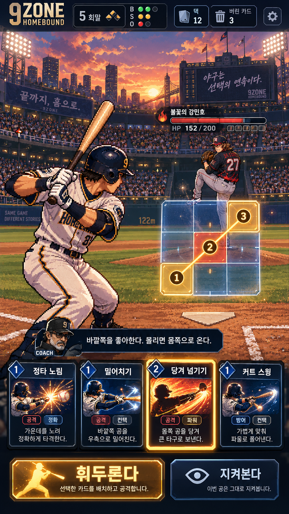
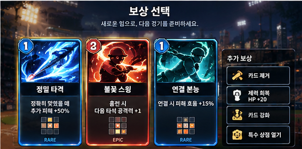

# 목업 대비 실플레이 품질 격차 분석 — 2026-09-28

## 결론

현재 캡처는 목표 목업의 구성요소 일부를 갖췄지만, **카메라 구도·인물 비율·광원·정보 위계가 하나의 장면으로 통합되지 않은 상태**다. 버튼 잘림만 고쳐도 목업 수준에 도달하지 않는다. 가장 먼저 타자/투수/마운드/홈플레이트의 관계와 배우 정체성을 고정하고 그 구도 위에 UI를 배치해야 한다.

이번 분석은 사용자가 제공한 7개 캡처, 추가 플레이 제보, 저장소 목표 목업 3장(전투 세로·보상·강판)의 직접 시각 비교 및 후보 브랜치 코드 읽기에 근거한다. 실기기 재현, FPS 측정, 블라인드 채점 또는 구현 완료 판정은 아니다. [기존 문제 보고서](2026-09-28-mobile-playtest.md)의 M01~M10을 함께 본다.

## 비교 기준과 예외

- 목표: [TARGET-MOCKUP](../design/v14/TARGET-MOCKUP.md), [QUALITY-BAR](../art/QUALITY-BAR.md), 아래 목표 이미지.
- 목업의 남성 투수를 되살리는 작업이 아니다. 여성 로스터와 여성 레드 러시 유지가 확정 조건이다.
- 목업의 HP·카드 수치·추가 보상은 시각 예시다. 추가 보상 없음/제거는 라커룸이라는 TARGET-MOCKUP D5를 유지한다. 일부 후속 에셋 감사 문서에 추가 보상 아이콘 제작이 적혀 있지만, 그것을 게임 규칙 변경 승인으로 해석하지 않는다.
- 보상/강판 목표는 가로 이미지이고 실플레이는 세로다. 똑같은 좌표가 아니라 주인공, 카드 비교, 상태·정보 위계를 평가한다.
- 실제 플레이 배포 SHA는 미확인이다. 후보 코드의 존재를 현재 배포본의 확정 원인으로 쓰지 않는다.
- PR #98 설명에는 원본 2장 업로드 미완료 기록이 남아 있다. 이번 비교에는 저장소에 실제 존재하고 직접 열람한 benchmark/target 이미지를 사용했다. 기준 문서 상태의 불일치도 정리할 필요가 있다.

## 직접 비교

| 목표 전투 | 사용자 실플레이 |
|---|---|
|  |  |

| 목표 보상 | 사용자 승리·보상 |
|---|---|
|  |  |

## 품질 차이의 구체적인 원인과 개선 방향

| 항목 | 목업에서 성립하는 것 | 현재 캡처의 격차 | 해야 할 일 / 검수 기준 |
|---|---|---|---|
| V01 카메라와 구도 | 가까운 타자→홈플레이트/9존→투수로 시선이 이어짐. 석양·도시·관중이 장면 규모를 만듦 | 잔디가 넓게 노출되고 하늘/관중 존재감이 약함. 타자는 왼쪽 밖으로 잘리고 투수는 오른쪽 끝에 고립됨 | 화면비별 배경 크롭과 배우 기준점을 함께 설계. 경기장 원근에 맞는 대결 축을 먼저 확정. UI 없는 상태에서도 대결 구도가 읽혀야 함 |
| V02 배우 비율과 정체성 | 긴 팔다리·어깨 회전·손/배트 방향이 읽히는 성인 타자 | 현재 타자는 큰 머리와 짧은 체형의 SD 비율. 투수는 더 길고 가는 비율이며 보상 초상은 다시 큰 애니 일러스트 | 같은 타자 #9의 얼굴·헬멧·유니폼·체형·시점을 잠금. 기존 고해상도 후보 채택 여부와 runtime/fallback 동일성 검수. 단순 확대만으로 해결 불가 |
| V03 경기장과 인물의 빛/접지 | 석양의 주황 림라이트, 차가운 그림자, 발과 지면의 관계가 하나의 공간으로 읽힘 | 배경은 세밀한 잔디, 타자는 거친 픽셀, 투수는 별도 밀도. 발 주변 어두운 면은 보이지만 마운드 접지·공통 광원이 설득력 부족 | M10 좌표를 먼저 수정하고 인물/배경의 명도·광원·픽셀 표시 밀도 비교. 그림자 또는 glow 추가만으로 접지 문제를 숨기지 않음 |
| V04 9존의 재질과 선택 흐름 | 경기장이 비치는 청색 유리, 큰 순번 토큰, 끊김 없이 이어지는 금빛 경로 | 짙은 네이비 판이 배경을 막고 ‘안 던짐’ 반복이 면적을 차지함. 결과에는 작은 순번·점선·원형·마름모가 함께 놓임 | 공개 확률 정보는 보존. 비투구 셀은 약하게, 선택 순번/유효 연결은 강하게, 실제 공은 별도 형태로 표시. 3장 배치에서 시작·순서·결과가 즉시 구분되어야 함 |
| V05 카드의 상품성 | 제목·비용·원화·효과가 균형 잡힌 카드, 차별화된 실루엣, 정밀한 프레임 | 전투 카드는 작은 가로 이미지 띠와 넓은 아래 텍스트 면. 보상은 카드 높이가 다르고 효과/조건이 생략됨. 카드 안 얼굴·배트가 종종 잘림 | 카드 ID별로 작은 크기에서 행동이 읽히는 크롭 지정. 전투·보상·상세의 공통 카드 구조 정리. 중복 손패는 정상일 수 있으므로 동일 카드 반복과 매핑 오류를 구분 |
| V06 UI 재질과 화면 간 통일 | 베벨 금속·유리·발광이 같은 두께/팔레트/타이포 위계 안에서 변주됨 | 전투의 둥근 보라 테두리, 상점의 밝은 종이판, 승리의 큰 줄무늬 말풍선, 상세의 청록 테두리가 서로 다른 디자인처럼 읽힘 | 하나의 패널/버튼/카드 규격을 만들되 화면별 크기와 역할에 맞춰 적용. border·코너·명도·폰트 위계를 통일. 신규 장식보다 기존 키트의 올바른 적용과 대비 수정부터 |
| V07 의미와 정보 위계 | 투수 정보는 투수 가까이, 코치 조언은 코치와 함께, 현재 선택이 가장 선명함 | HP는 좌상단/투수는 우상단/투수 대사는 하단 코치 초상 옆으로 분리. 보상 화면도 상단 메뉴와 대형 초상이 카드보다 먼저 눈에 들어옴 | 이름·HP·의도·배우를 하나의 정보군으로 연결. 코치 조언과 투수 도발의 화자/초상 분리. 선택 단계에는 선택 내용이 중심이 되도록 강조 순서 조정 |
| V08 결과의 감정과 보상 전환 | 강판은 패배 자세와 HP 0, 보상은 카드 선택을 중심으로 하는 별도 순간 | 15161은 ‘강판’ 문구와 웃으며 준비 자세를 취한 초상을 큰 면적으로 표시하고 그 아래 카드/빈 버튼이 경쟁함 | 캡처는 승리 보상 화면이므로 앞선 강판 애니메이션 부재를 단정할 수는 없음. 강판 순간→상대 대사→보상 선택의 강조를 분리하고 최종 보상 상태에서 카드를 가장 읽기 쉽게 구성 |

## 새로 확인한 기능/의미 문제: 코치 초상과 투수 대사의 화자 혼동

15157의 코치 초상 및 COACH 표지 옆에 ‘레드 러시 — 첫 타석부터 불 붙여볼까?’, 15163에서는 ‘청록 미라주 — 가끔은 신기루도 걸려.’가 표시된다. 대사의 화자는 투수인데 초상은 코치로 읽힌다. 예쁜 말풍선을 붙였는지와 별개로 정보 의미가 어긋난다.

수정 선택지는 (1) 투수 도발을 투수 가까이에 배치하고 코치 조언을 유지하거나, (2) 공용 대화창에서 화자에 맞게 초상·역할 라벨을 바꾸는 방식이다. 코치 대사를 숨겨 중요한 전술 힌트까지 없어지는지 함께 검수한다.

## 코드로 확인한 구조와 원인 후보

읽은 코드 기준: `claude/integrate-ag-v15@738ef2f13b994921d3620e23fed902f614234156`. 이는 플레이 배포 SHA로 확인되지 않았다.

### 1. 타자 외형이 달라질 수 있는 렌더링 경로가 공존함

- [App.jsx](https://github.com/jjsjb88-alt/9-baseball/blob/738ef2f13b994921d3620e23fed902f614234156/src/duel/App.jsx)는 BallparkBattle에 새 `BATTER_V15_SHEET`와 기존 `Sprite` 기반 `batterArt`를 함께 전달한다.
- [BallparkBattle.jsx](https://github.com/jjsjb88-alt/9-baseball/blob/738ef2f13b994921d3620e23fed902f614234156/src/duel/BallparkBattle.jsx)는 Pixi 배우와 DOM 배우를 함께 구성하며, [ballpark.css](https://github.com/jjsjb88-alt/9-baseball/blob/738ef2f13b994921d3620e23fed902f614234156/src/duel/ballpark.css)는 `pixi-batter` 준비 상태에서 DOM 쪽을 숨긴다.
- [BallparkActors.jsx](https://github.com/jjsjb88-alt/9-baseball/blob/738ef2f13b994921d3620e23fed902f614234156/src/duel/BallparkActors.jsx)는 초기화 완료 시 onReady를 설정하고 오류/정리 시 null로 되돌린다. effect는 pitcherAtlas/batterSheet 변경에 의존한다.
- 따라서 로딩·재초기화·오류 시 서로 다른 외형이 노출될 **가능성**을 우선 조사한다. 실제 깜빡임을 재현하거나 원인으로 확정한 것은 아니다. fallback은 제거부터 할 것이 아니라 같은 캐릭터/기준점으로 맞추고 전환을 검증해야 한다.

### 2. 배경과 투수 위치가 고정 숫자의 조합으로 배치됨

[v14-portrait-master.css](https://github.com/jjsjb88-alt/9-baseball/blob/738ef2f13b994921d3620e23fed902f614234156/src/duel/v14-portrait-master.css)에는 배경 `125% auto`와 `bottom -31.2vw`, 투수 `right:1%; bottom:71vw; height:24vw`, 타자 `left:-27%; height:78vw`가 있다. 실제 투수판/발 기준점을 런타임에서 검증했다는 증거는 아니다.

먼저 표시 중인 배경·배우의 실제 bounds/투명 여백과 computed style을 기록해야 한다. 배경의 마운드 기준점을 화면 좌표로 변환한 결과와 발 기준점을 맞추고, 세로/가로 전용 프레이밍을 적용하는 것이 조사 방향이다. 숫자 하나만 옮겨 모든 화면을 고쳤다고 선언하지 않는다.

### 3. 코치 말풍선의 화자 혼동은 후보 코드에서도 확인됨

BallparkBattle의 `bp-coach-wrap`는 COACH 초상을 항상 표시하면서 `voice`가 있으면 투수 이름과 대사를 같은 말풍선에 넣는다. 세로 CSS는 이때 `bp-coach-text`를 숨긴다. 이미지에서 관찰된 혼동과 일치하는 구조다. 수정은 화자와 전술 힌트 전달을 함께 검토해야 한다.

### 4. 카드와 UI가 목표와 다른 재질로 강제됨

세로 CSS에는 카드 `border-image:none!important`, 단색 계열 그라데이션/둥근 모서리, 높이 50px의 원화 상자, 설명 `white-space:nowrap; text-overflow:ellipsis`가 있다. UI 키트나 큰 원화 파일이 존재해도 실제로는 작은 띠와 CSS 패널로 보일 수 있는 이유다. 이 선언들의 존재는 확인했지만 최종 cascade/배포 적용 여부는 미검증이다.

## 왜 파일이 늘어도 퀄리티가 따라오지 않는가

1. **파일 제작 완료와 화면 완성을 혼동하기 쉽다.** 최신 PHONE_ASSET_QUEUE는 원본·규격 검수를 완료했어도 런타임 연결·모바일 배치·10화면 합격은 아직 미완료라고 명시한다.
2. **여러 세대의 배우·UI가 함께 남아 있다.** 최종 사용 경로와 fallback, 화면별 크롭을 하나의 캐릭터 기준으로 묶어야 한다.
3. **요소별로 비슷하게 만들고 장면 전체 비율을 검수하지 않았다.** 불꽃 아이콘·금색 버튼·카드 그림이 있다는 사실만으로 목업의 구도와 존재감이 생기지 않는다.
4. **상태 전환에서 품질이 유지되는지 검수가 부족하다.** 정지 준비 화면만 맞춰도 선택·결과·보상·주소창 변화에서 깨질 수 있다.
5. 기존 자동 QA 통과는 잘림·화풍·감정 전달을 모두 증명하지 않는다. 기능 QA와 목업 비교는 별도 완료 조건이다.

근거: [최신 제작 대기열](https://github.com/jjsjb88-alt/9-baseball/blob/c2f2b26e3cdc212297b8e7fcbdf6a2c4e84d0089/docs/art/PHONE_ASSET_QUEUE.md), [목업 일치 계획](https://github.com/jjsjb88-alt/9-baseball/blob/c2f2b26e3cdc212297b8e7fcbdf6a2c4e84d0089/docs/art/MOCKUP_FIDELITY_PLAN_2026-09-28.md). 문서 내 과거 감사 내용은 최신 파일·연결 상태로 다시 검증해야 한다.

## 다음 수정의 실행 순서

1. **배포본 특정 및 배우 안정화:** 같은 시드·viewport·배포 SHA 기록 → M09/M10 → 준비/스윙/결과/투수 교체 연속 영상.
2. **세로 전투 한 화면의 구도 고정:** 경기장 크롭, 타자 성인 비율/화면 점유, 투수 마운드 접지, 9존 위치를 한 묶음으로 조정. 새 아트는 기존 후보 검수 후 실제 결손만 제작.
3. **같은 화면에서 UI 통합:** 9존 선택 흐름, HP/의도 묶음, 코치/투수 화자 분리, 카드 프레임과 크롭, 읽히는 행동 버튼.
4. **보상·상점 마감:** 먼저 M01/M02/M05 판독/선택 문제, 그다음 공통 재질·카드 높이·승리에서 선택으로 이어지는 위계.
5. **가로/PC와 전환 검수:** 화면만 줄이지 말고 화면비에 맞는 구도를 검수. 전투뿐 아니라 결과→보상→시설→지도에서도 동일한 디자인 규칙을 확인.

통과 조건: M01~M10 해결 근거 + 코치/투수 화자 일치 + 목표와 동일 상태 Before/After + 배우 연속 영상 + 관련 회귀 검증. 정식 품질 통과 선언은 QUALITY-BAR의 독립 평가 절차를 따르며, 이번 분석에 임의의 합격 점수를 붙이지 않는다.

## 이번 분석에서 보류한 화면

지도·타이틀·덱·도감·홈런·엔딩과 가로 실플레이는 이번 7장에 없다. 과거 감사 문서의 우려는 후속 후보로만 참고하며, 현재 화면을 확인하지 않고 새 결함으로 확정하지 않는다. 같은 카드가 여러 장 보이는 것, 여성 투수를 유지하는 것, 확률 숫자가 목업에 없는 것은 그 자체로 결함이 아니다.

문서/분석만 추가했다. 런타임 변경·실기기 재현·게임 수정·배포는 수행하지 않았다.
